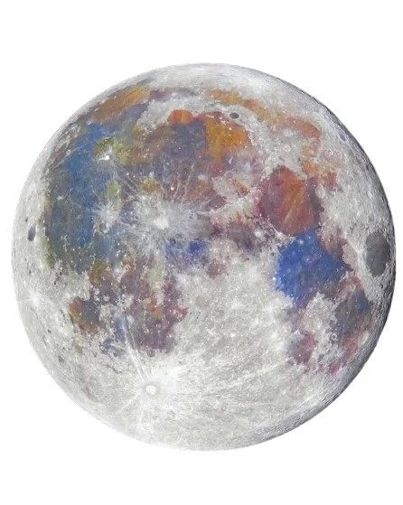
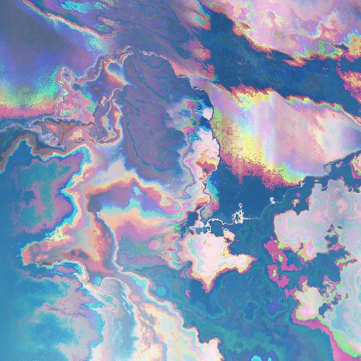

  
  <h1>Hey everyone! 
  I'm Noémie</h1>

  
  <h3>✨ About me</h3>
    

      &emsp;
        
      &emsp;- &nbsp;🔭 I’m currently working on 42's Common Core projects 
      &emsp;- &nbsp;📚 I’m currently learning to code in Python and C
    

   
  <h4>🔗 Connect with me:</h4>
    

      &nbsp;
      
    

  <h3>📊 GitHub stats</h3>
    
   
    
   

  <h3>💻 Languages & Tools</h3>

  <table>
    <tr>
      <td align="center" width="96">
      
       C
      </td>
      <td align="center" width="96">
      
       Python
      </td>
      <td align="center" width="96">
      
       Bash
      </td>
    </tr>
  </table>

  <table>
    <tr>
      <td align="center" width="96">
      
       Git
      </td>
      <td align="center" width="96">
      
       Github
      </td>
      <td align="center" width="96">
      
       VSCode
      </td>
      </td>
      <td align="center" width="96">
      
       Linux
      </td>
    </tr>
  </table>
  
   

  <h3>🌱 42 Cursus</h3>
    <h4>Circle 0:</h4>
      

        <ul>
          <li> <b> <a href="https://github.com/noemiepi/libft">Libft:</a> &nbsp;&nbsp;🍀 125/100 </b> </li>
            &emsp;Creation of my first library in C 
        </ul>
      

    <h4>Circle 1:</h4>
      

        <ul>
          <li> <b> <a href="https://github.com/noemiepi/ft_printf">ft_printf:</a> &nbsp;&nbsp;🍀 100/100 </b> </li>
            &emsp;Recoding the printf function in C
          <li> <b> <a href="https://github.com/noemiepi/get_next_line">get_next_line:</a> &nbsp;&nbsp;🍀 120/100 </b> </li>
            &emsp;A program that reads a .txt file line by line
          <li> <b> <a href="https://github.com/noemiepi/Born2beRoot">Born2beRoot:</a>&nbsp;&nbsp;🍀 115/100 </b> </li>
            &emsp;Setting up my first Virtual Machine (VM)
        </ul>
      

    <h4>Circle 2:</h4>
      

        <ul>
          <li> <b> <a href="https://github.com/noemiepi/push_swap">push_swap:</a> &nbsp;&nbsp;🍀 100/100 </b> </li>
            &emsp;A program that will sort values as fast as possible
          <li> <b> <a href="https://github.com/noemiepi/Python-Modules">Python-Modules:</a> &nbsp;&nbsp;🍀 100/100 </b> </li>
            &emsp;A serie of modules to learn the basis of the Python language
          <li> <b> <a href="https://github.com/noemiepi/A-Maze-ing">A-Maze-ing:</a> &nbsp;&nbsp;🍀 121/100 </b> </li>
            &emsp;A program that randomly generates a solvable maze (Group project with <a href="https://github.com/Fredrnx">frrenaux</a>)
        </ul>
      

    <h4>Circle 3:</h4>
      

        <ul>
          <li> <b> <a href="https://github.com/noemiepi/Call_Me_Maybe">Call Me Maybe:</a> &nbsp;&nbsp;🍀 115/100 </b> </li>
            &emsp;A first introduction to coding an AI by learning function calling with a LLM 
        </ul>
      

    <h4>Circle 4:</h4>
      

        <ul>
          <li> <b> <a href="https://github.com/bebejamin1/Pacman">Pac-Man:</a> &nbsp;&nbsp;☘️ .../100 </b> </li>
            &emsp;A recreation of the game Pac-Man
            (Group project with <a href="https://github.com/bebejamin1">bebejamin1</a>)
        </ul>
      

  <i>🪐 Last modified: <b>24/07/2026</b></i>

  

   
    
  

    

